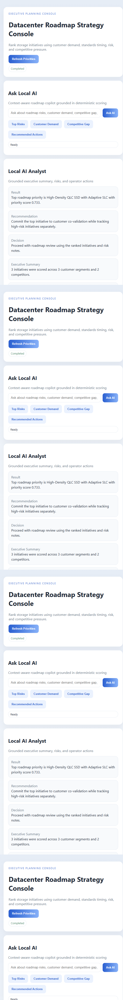

# Datacenter Roadmap Strategy Console

Datacenter Roadmap Strategy Console is a local planning tool for comparing infrastructure roadmap options across customer demand, technology readiness, competitor movement, and execution risk.

## Product Screenshot



It combines deterministic scoring with a local AI strategy analyst so users can see the numeric ranking and ask why a roadmap option should be prioritized.

## What It Does

- Loads customer, technology, and competitor data from local sample files.
- Scores roadmap candidates using repeatable business and technical factors.
- Ranks opportunities by impact, readiness, and risk.
- Displays roadmap priorities in a browser UI.
- Provides AI-generated strategy guidance grounded in the scorecard.

## AI Features

- Local AI analyst explains why a roadmap option ranks high or low.
- AI chat answers roadmap questions using the current score data.
- Recommendations reference deterministic score inputs instead of free-form guesses.
- Product UI includes a visible AI panel for planning review.

## Architecture

```text
customers + technologies + competitors
        |
        v
Roadmap scoring engine -> ranked strategy options
        |
        v
Local AI analyst / chat -> explanation + planning guidance
        |
        v
Browser console
```

## Run

```powershell
run.bat
```

## Local AI Setup

Use LM Studio or another local OpenAI-compatible endpoint with a small model such as `google/gemma-4-e4b`.

The scoring engine runs without AI; AI adds explanation and planning narrative.

## Main Files

- `server.py` - local API and AI insight endpoint.
- `src/datacenter_roadmap_strategy_console/engine.py` - deterministic scoring logic.
- `samples/` - customer, technology, and competitor inputs.
- `web/` - browser UI.

## Output

The tool returns ranked roadmap options, score components, risk notes, and an AI-generated strategy recommendation.
